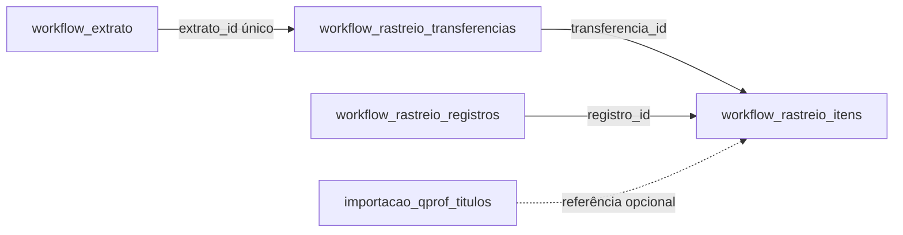

# Banco e composições de rastreio

Banco local: `database/allcredit.sqlite`. Valores monetários são centavos inteiros; Extrato e Saldo Sistema preservam também o restante inteiro em centésimos de centavo para dados de até quatro casas decimais. Formulários/API de escrita recebem `valor_reais` decimal com ponto. Migrations são versionadas em `sistema_migrations`, com foreign keys habilitadas. A estrutura da precisão e o processo de substituição da base estão em arquivo privado da migração.

| Tabela | Responsabilidade |
| --- | --- |
| `workflow_extrato` | Movimentações bancárias. Status é controle do Qprof, independente do rastreio. |
| `workflow_rastreio_transferencias` | Código TRF único/persistente, `extrato_id` único opcional, versão, auditoria e metadados originais. Transferências importadas sem correspondência preservam conta/data/valor da fonte. |
| `workflow_rastreio_itens` | Alocações da composição: transferência, `registro_id`, consulta Qprof opcional, campos visuais, valor atual e origem preservada. |
| `workflow_rastreio_registros` | Item econômico persistente, com recebimentos, partes, datas e condição original; liga entrada e múltiplas saídas. |
| `workflow_rastreio_configuracoes`, `workflow_rastreio_importacoes`, `workflow_rastreio_sequencias` | Início do controle, proveniência da carga e sequência dos códigos por data. |
| `importacao_qprof_titulos` | Base de consulta: número, cedente, sacado, valor, data_liquidacao, carteira e carteira_interna. Não armazena vínculos operacionais. |
| `gerenciador_naturezas`, `gerenciador_entidades`, `gerenciador_contas` | Cadastros relacionados ao Extrato. |
| `workflow_saldos` | Uma linha por `conta_id`, com `saldo_sistema`, `saldo_banco`, `saldo_final` e `updated_at`. |



## Regras

- Vincular título copia os campos para um item independente. Alterar ou excluir a fonte Qprof não altera o conteúdo salvo; excluir a fonte apenas limpa sua referência opcional.
- Tipos: `titulo`, `parcial`, `tarifa`, `custas`. Itens manuais não criam títulos Qprof nem movimentações no Extrato. Valores negativos permitem ajustes; novos itens não aceitam zero. A migration 010 acrescenta ajuste_saldo, recebimento_sem_titulo, devolucao_ajuste e divergencia; alocações importadas preservam zero e NULL.
- O mesmo título pode servir de referência a composições diferentes, inclusive valores parciais. Não existe bloqueio global de títulos utilizados.
- Confirmar ou salvar composição comum exige soma exata ao valor absoluto da movimentação, em transação. Composições importadas podem preservar incompletudes/divergências, que continuam sinalizadas. A operação não altera o status do Extrato.
- Na edição, itens mantidos preservam IDs; itens desvinculados são excluídos e novos itens recebem novos IDs. A versão evita sobrescrever uma edição concorrente ou uma alteração do Extrato.
- Salvar uma composição vazia remove o rastreio e devolve a movimentação à fila. O Extrato permanece.
- Todos os campos do Extrato permanecem editáveis. Uma alteração de valor pode produzir diferença na composição; a aba Rastreio e o PDF mostram essa diferença até o operador ajustá-la. Metadados operacionais são lidos do Extrato atual; metadados da fonte importada permanecem separados para auditoria.
- Excluir movimentação remove seu rastreio e seus itens por cascade; a base Qprof e composições de outras movimentações permanecem intactas. A interface informa essa consequência na confirmação.

## Migrações

`003_rastreio_composicoes.sql` converte cada vínculo existente em item próprio, preservando títulos, valores, IDs de transferências e timestamps. Uma entrada e uma saída do mesmo título produzem dois itens independentes. Remove os vínculos circulares e os bloqueios antigos. Cedente fica vazio para registros anteriores que não tinham essa informação, sem inventar dados.

Os arquivos `001` e `002` são históricos imutáveis. O teste de migração começa num banco antigo já preenchido, aplica as migrações e verifica composição, exclusão em cascade e integridade referencial. Backups locais ficam em `database/backups/`.

## Consultas

```sql
SELECT tr.id, tr.extrato_id, e.data, e.valor,
       SUM(i.valor) total_composicao,
       abs(e.valor)-SUM(i.valor) diferenca
FROM workflow_rastreio_transferencias tr
JOIN workflow_extrato e ON e.id=tr.extrato_id
JOIN workflow_rastreio_itens i ON i.transferencia_id=tr.id
GROUP BY tr.id;

SELECT tipo,titulo,cedente,sacado,valor / 100.0 valor_reais
FROM workflow_rastreio_itens WHERE transferencia_id=1 ORDER BY id;

PRAGMA foreign_key_check;
```

## Funções e saldos

A migração `004_contas_funcoes_saldos.sql` adiciona `neutra` à função da conta, remove a configuração separada de rastreio e cria `workflow_saldos`. Mantém IDs, auditoria, movimentações, títulos e composições. A recriação da tabela de contas ocorre em transação com verificação de todas as referências antes do commit; o runner reativa a fiscalização de foreign keys também em caso de falha.

A migração `008_contas_rastreadas.sql` restringe `gerenciador_contas.funcao` a `operacional`, `neutra` e `rastreada`, também validadas pela API. Singulare 89727720 passa a Rastreada e Singulare 59697697 a Operacional. As funções antigas das demais contas tornam-se Operacional; Neutra é preservada. Nenhuma movimentação muda de conta e os saldos, importações, composições e auditoria existentes permanecem intactos. Novas composições exigem conta ativa Rastreada: créditos entram em Conciliação e débitos em Liquidação. Rastreios históricos continuam disponíveis para consulta e correção, mesmo após uma mudança de função.

`saldo_sistema` é inicializado pela soma de `workflow_extrato.valor` por conta. Triggers acompanham criação da conta e inclusão, edição (inclusive troca de conta) e exclusão das movimentações na mesma transação. `saldo_banco` é nullable, alimentado por Importação → Extratos. `saldo_final` é nullable, aceita zero e valores negativos; permite edição manual ou preenchimento na importação quando os saldos coincidem. Alterar movimentações não sobrescreve os outros saldos.

A consulta exibe somente contas ativas de todas as funções. A conta Neutra não aceita novas movimentações; seus registros históricos não são apagados ao mudar a função e continuam no cálculo. Contas referenciadas no Extrato não podem ser excluídas; excluir uma conta sem movimentações remove seu saldo por cascade.

## Importação de extratos

A migração `006_importacao_extratos.sql` padroniza os nomes das três contas e cria:

- `importacao_extratos_fontes`: vínculo estável entre banco/agência/número e conta do Gerenciador, com posição do último saldo bancário.
- `importacao_extratos_lotes`: arquivo, hash SHA-256, período solicitado, contagens e resultado da atualização do saldo.
- `importacao_extratos_registros`: chave original por conta, documento, data/hora (ou só data no Bradesco), valor, lote e referência à movimentação. A identidade permanece após edição ou exclusão do registro para que uma reimportação não recrie lançamentos deliberadamente removidos.

Cada arquivo é validado antes da transação. Movimentações, identidades, lote e atualização de saldos são gravados atomicamente. O cadastro da movimentação usa status `pending`, entidade/natureza nulas e a conta vinculada à fonte. Nenhuma linha de saldo ou total é criada como movimentação pelo importador.

A identidade inclui conta, data/hora, valor e documento; no Bradesco, que não fornece hora e repete números de documento, inclui também histórico normalizado e ocorrência. Movimentos legítimos com mesmo horário/valor e documentos diferentes são preservados. Não há dependência do nome do arquivo para deduplicar; na Singulare, ele também identifica a conta.

O último saldo válido dentro do intervalo usa o horário da movimentação correspondente. A posição do saldo impede regressão ao importar períodos anteriores. `workflow_saldos.updated_at` recebe esse instante em UTC para exibição em São Paulo; no Bradesco, recebe apenas a data disponível, sem horário artificial. Edições locais posteriores preservam essa referência bancária. Quando os saldos Sistema e Banco coincidem em centavos, a importação preenche o Saldo final. Se divergem, mantém seu valor e informa a necessidade de conferência.

## Base Qprof e snapshots completos

A migração `007_importacao_qprof.sql` retém somente os sete campos de negócio indicados no arquivo de instruções, além dos identificadores e timestamps. Número de título não é único. IDs autoincrementais não são reutilizados na substituição da base. `importacao_qprof_base` registra versão, arquivo, quantidade e atualização da base vigente; `importacao_qprof_busca` é um índice FTS5 derivado para pesquisa textual, mantido por triggers.

Cada atualização valida a planilha inteira antes de uma transação que substitui os títulos. Não cria Extrato nem altera Saldos. Os itens do Rastreio guardam também data_liquidacao, carteira e carteira_interna. Ao excluir a fonte, a FK fica nula e o snapshot completo permanece. A versão das composições afetadas é incrementada para impedir salvamentos de telas antigas. Os campos adicionais vêm da fonte no primeiro vínculo e do snapshot em edições seguintes; a tabela e o PDF continuam com Tipo, Título, Cedente, Sacado e Valor.

## Controle manual persistente

A migration `010_rastreio_controle.sql` amplia as tabelas existentes, preserva composições anteriores e introduz a identidade econômica entre as alocações. A documentação privada da carga inicial conserva o relatório dessa importação.

A migration `011_rastreio_revisoes.sql` registra auditoria e observações de revisão. Itens com `efeito = compensacao` referenciam `compensa_registro_id`: baixam o saldo de controle desse registro, sem somar ao total bancário da transferência. A condição Compensado por ajuste distingue esse encerramento de uma liquidação por débito. Veja a [regra de pendências](pendencias-rastreio.md).

A migration `012_rastreio_tipos.sql` restringe registros e composições a `titulo`, `parcial`, `tarifa`, `custas` e `ajuste`, com conversão dos valores antigos e preservação da categoria anterior. A regra atual de fila e os campos da revisão da coluna N estão em [Pendências e tipos](pendencias-rastreio.md).
